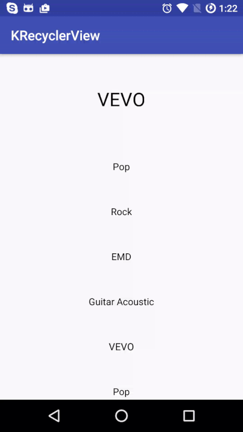

# KRecyclerView
[](https://travis-ci.org/Khang-NT/KRecyclerView) [  ](https://bintray.com/khang-nt/maven/krv/_latestVersion)

# Demo
 

# Install
```groovy
dependencies {
    compile 'org.k.recyclerview:krv:$paste-latest-version-here$'
}
```

# How to use:
## Add KRecyclerView to your layout:
```xml
<org.k.recyclerview.KRecyclerView
        android:id="@+id/krv"
        app:focusedItemHeight="200dp"
        app:defaultItemHeight="80dp"
        app:updateWhenPixelChangedLargerThan="1dp"
        android:layout_width="match_parent"
        android:layout_height="match_parent"/>
```
## Customize:
Attribute | Format | Default Value | Description
--------- | ------ | ------------- | -----------
`focusedItemHeight` | dimension | 400px | Max height of focused items
`defaultItemHeight` | dimension | 200px | Min height of default items
`flingScrollSpeedFactor` | float | 1f | Decrease or increase scrolling speed of recycler view. Default is 1, the higher the faster, and vice versa.
`updateWhenPixelChangedLargerThan` | dimension | 2px | Working like FPS, 0 is smoothest but lowest performance. Recommended value: between 2 and 10.